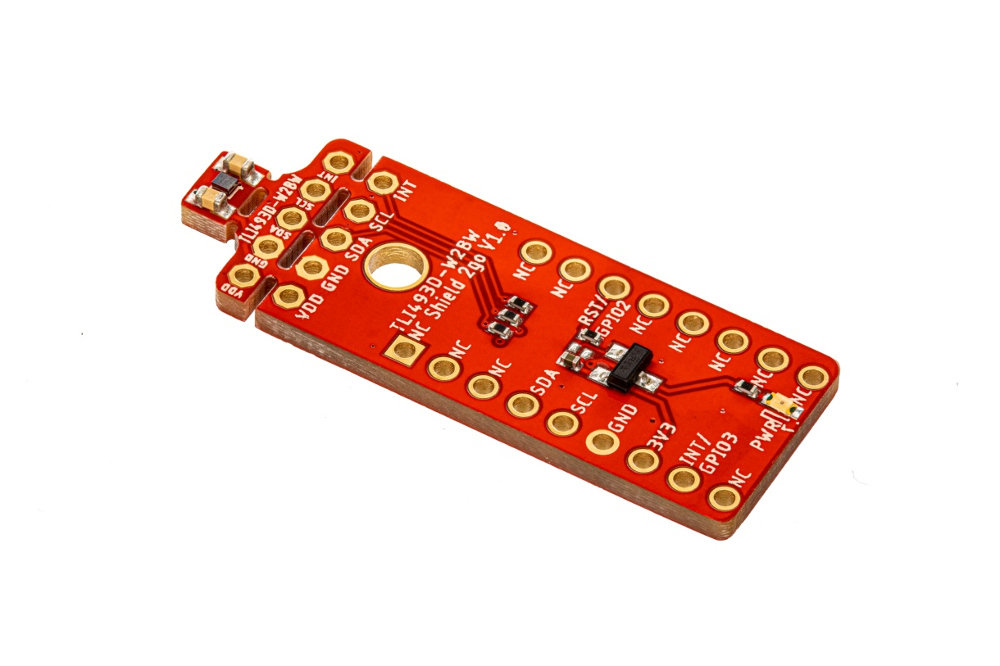

# XENSIV™ 3D Magnetic Sensor TLx493D Arduino Library


Arduino Library of Infineon's [**XENSIV™ 3D Magnetic Sensor TLx493D**](https://www.infineon.com/cms/en/product/sensor/magnetic-sensors/magnetic-position-sensors/3d-magnetics/) family.

### Supported Sensor Platforms

<table>
    <tr>
        <td></td>
        <td></td>
        <td></td>
        <td></td>
    </tr>
    <tr>
        <td style="test-align : center"><a href="https://www.infineon.com/cms/en/product/evaluation-boards/s2go_3d-sense_tlv493d/">XENSIV™ TLV493D-A1B6 Shield2Go </a></td>
        <td style="test-align : center"><a href="https://www.infineon.com/cms/en/product/evaluation-boards/tlv493d-a1b6-ms2go/">XENSIV™ TLV493D-A1B6 2GO kit</a></td>
        <td style="test-align : center"><a href="https://www.infineon.com/cms/en/product/evaluation-boards/s2go_3d_tle493dw2b6-a0/">XENSIV™ TLE493D-W2B6 Shield2Go</a></td>
        <td style="test-align : center"><a href="https://www.infineon.com/cms/en/product/evaluation-boards/tle493d-w2b6-ms2go/">XENSIV™ TLE493D-W2B6 2GO kit</a></td>
    </tr>
    <tr>
        <td></td>
        <td></td>
        <td></td>
        <td></td>
    </tr>
    <tr>
        <td style="test-align : center"><a href="">XENSIV™ TLI493D-W2BW Shield2Go</a></td>
        <td style="test-align : center"><a href="">XENSIV™ TLE493D-P2B6 2GO kit</a></td>
        <td style="test-align : center"><a href="">XENSIV™ TLV493D-A1B6 Shield2Go</a></td>
        <td style="test-align : center"><a href="">XENSIV™ TLV493D-A1B6 Shield2Go</a></td>
    </tr>
</table>

As well as the following sensors and the associated boards:
- TLx493D_A2B6
- TLx493D_A2BW

### Getting Started

Find a detailed getting started guide for the supported XENSIV™ 3D Magnetic TLX493D Sensors [here](link).

### Library Installation

Look for ```XENSIV 3D Magnetic Library´´´ in the Arduino library manager in order to install this library. An alternative installation method can be found [here](link).

### API Reference

Discover all the API features and functions in the [API Reference]() section of the documentation.

### More Information

More information can be found within the library [docs]().

### License

See the [LICENSE](LICENSE.md) file for more details about the license.