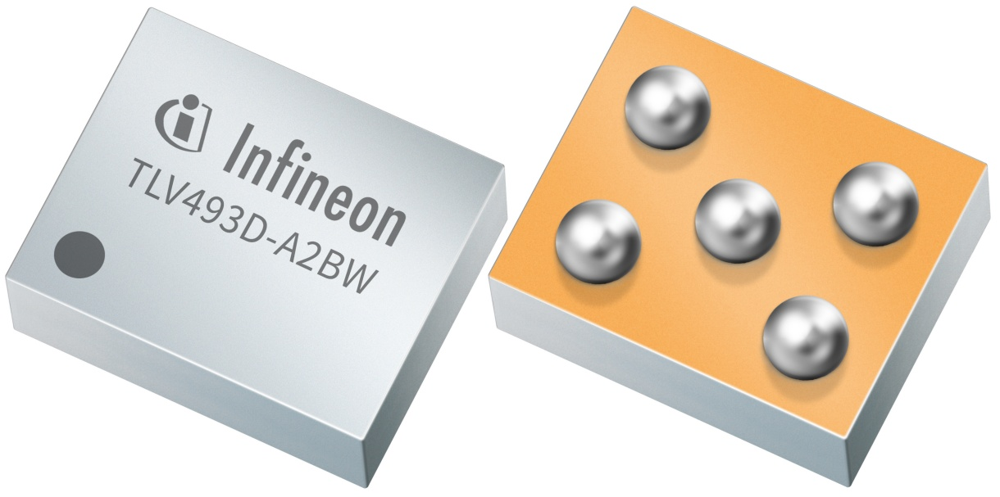

****
Home
****

Welcome to the Infineon XENSIV™ 3D Magnetic Sensors TLx493D Arduino library documentation.

.. image:: img/Arduino_Logo.png
    :height: 200

.. toctree::
    :maxdepth: 1
    :caption: Content

    getting_started
    hw-platforms
    lib-install
    examples
    api-ref

License
=======
Find the license for this library `here <https://github.com/Infineon/>`_.