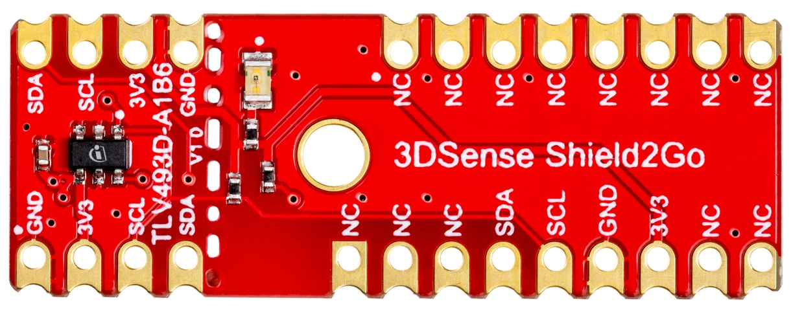
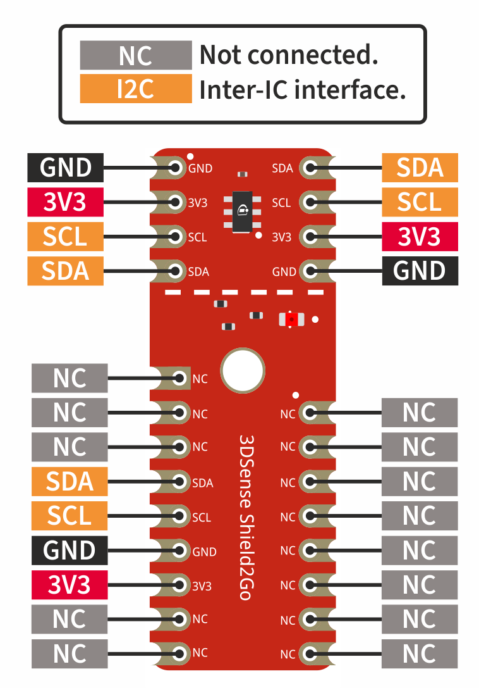
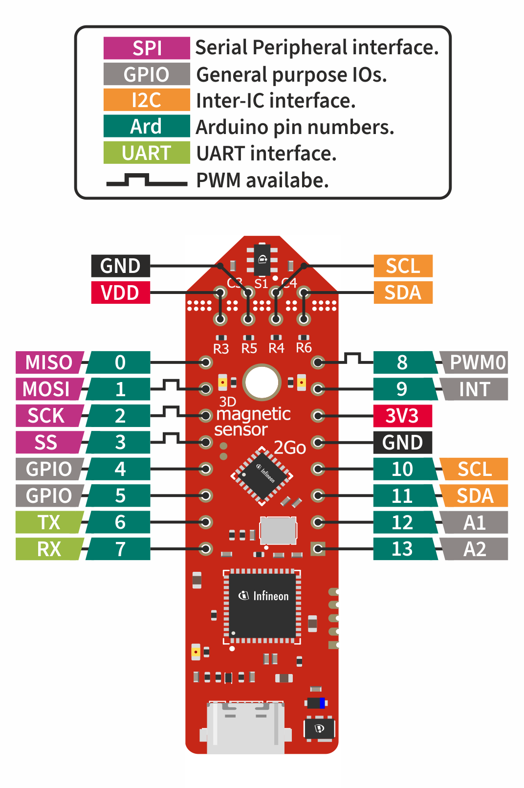
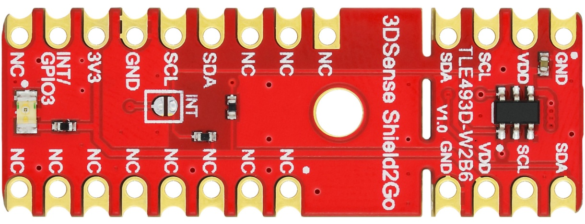
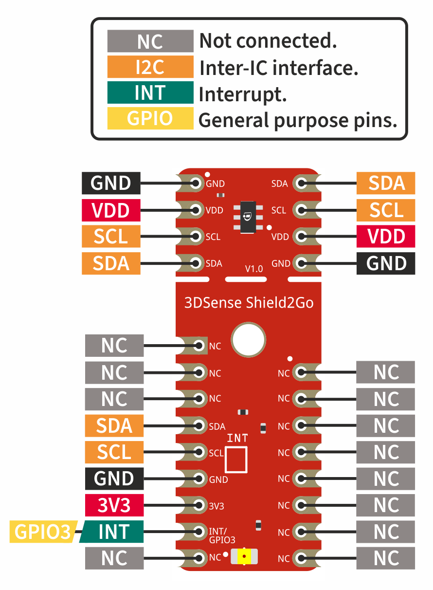
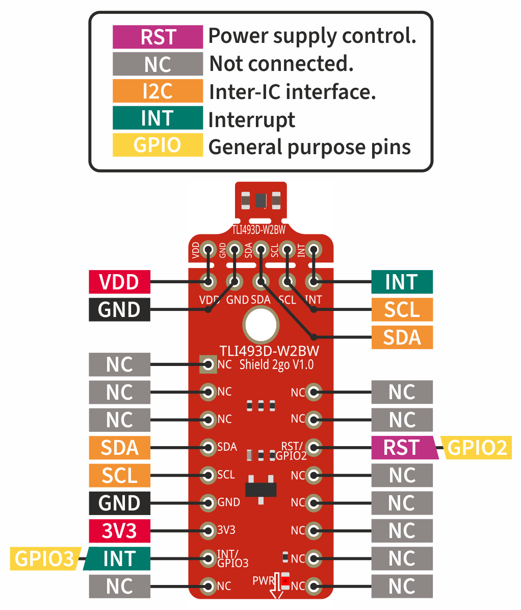

.. _hw-platforms:

Hardware Platforms
==================

Supported Sensor Boards
-----------------------

This library support almost the complete XENSIV™ 3D Magnetic Sensors Tlx493d family. This includes the Shields2Go as well as the 2GO Kits of the sensors. Following you will see a list of boards which are supported by this library.

XENSIV™ TLV493D-A1B6 Shield2Go
""""""""""""""""""""""""""""""

* `Product Page - XENSIV™ 3D Magnetic Sensor TLV493D-A1B6 Shield2Go <https://www.infineon.com/cms/en/product/evaluation-boards/s2go_3d-sense_tlv493d/>`_
* `Quick Start Guide - XENSIV™ 3D Magnetic Sensor TLV493D-A1B6 Shield2Go <https://www.infineon.com/dgdl/Infineon-TLV493D-A1B6-3DSense-Shield2Go_QS_July18-GS-v01_00-EN.pdf?fileId=5546d46264a8de7e0164c5e70a39048e>`_

Pinout Diagram
^^^^^^^^^^^^^^

Pin Description
^^^^^^^^^^^^^^^
.. list-table:: 
    :header-rows: 1

    * - Pin Name
      - Description
    * - 3V3
      - 3.3 V supply input
    * - VDD
      - Power supply pin - do not apply more than 3.3 V
    * - GND
      - Supply and signal ground
    * - SCL
      - Serial clock line of the I2C bus
    * - SDA
      - Serial data line of the I2C bus

----------------------------------------------------------------------

XENSIV™ TLV493D-A1B6 2GO Kit
""""""""""""""""""""""""""""

* `Product Page - XENSIV™ 3D Magnetic Sensor TLV493D-A1B6 2GO Kit  <https://www.infineon.com/cms/en/product/evaluation-boards/tlv493d-a1b6-ms2go/>`_
* `User Manual - XENSIV™ 3D Magnetic Sensor TLV493D-A1B6 2GO Kit <https://www.infineon.com/dgdl/Infineon-Infineon-3DMS2GO_TLv493D-A1B6-UM-v01_02-EN-UM-v01-UserManual-v01_02-EN.pdf?fileId=5546d462525dbac40152ac4ca1d318c2>`_

Pinout Diagram
^^^^^^^^^^^^^^

Pin Description
^^^^^^^^^^^^^^^

.. list-table:: 
    :header-rows: 1

    * - Pin Name
      - Description
    * - 3V3
      - 3.3 V supply input
    * - VDD
      - Power supply pin - do not apply more than 3.3 V
    * - GND
      - Supply and signal ground
    * - SCL
      - Serial clock line of the I2C bus
    * - SDA
      - Serial data line of the I2C bus
    * - TX
      - UART transmit pin
    * - RX
      - UART receive pin
    * - MISO
      - MISO pin of the SPI bus
    * - MOSI
      - MOSI pin of the SPI bus
    * - SCK
      - Clock pin of the SPI bus
    * - SS
      - Slave select pint of the SPI bus
    * - GPIO / 4
      - General purpose pin (Arduino pin number 4)
    * - GPIO / 5
      - General purpose pin (Arduino pin number 5)
    * - PWM0 / 8
      - Pulse-width modulation pin 0 (Arduino pin number 8)
    * - INT / 9
      - Interrupt pin (Arduino pin number 9)
    * - A1 / 12
      - Analog pin 1 (Arduino pin number 12)
    * - A2 / 13
      - Analog pin 2 (Arduino pin number 13)   
    
-----------------------------------------------------------------------

XENSIV™ TLE493D-W2B6 Shield2Go
""""""""""""""""""""""""""""""

* `Product Page - XENSIV™ TLE493D-W2B6 Shield2Go <https://www.infineon.com/cms/en/product/evaluation-boards/s2go_3d_tle493dw2b6-a0/>`_

Pinout Diagram
^^^^^^^^^^^^^^

Pin Description
^^^^^^^^^^^^^^^

.. list-table:: 
    :header-rows: 1

    * - Pin Name
      - Description
    * - 3V3
      - 3.3 V supply input
    * - VDD
      - Power supply pin - do not apply more than 3.3 V
    * - GND
      - Supply and signal ground
    * - SCL
      - Serial clock line of the I2C bus
    * - SDA
      - Serial data line of the I2C bus
    * - INT / GPIO3
      - Interrupt pin
       
----------------------------------------------------------------------

XENSIV™ TLE493D-W2B6 2GO Kit
""""""""""""""""""""""""""""

* `Product Page - XENSIV™ TLE493D-W2B6 2GO Kit <https://www.infineon.com/cms/en/product/evaluation-boards/tle493d-w2b6-ms2go/>`_
* `User Manual - XENSIV™ TLE493D-W2B6 2GO Kit <https://www.infineon.com/dgdl/Infineon-Infineon-3DMS2GO_TLE493D-W2B6-UM-v01_01-EN-UserManual-v01_01-EN.pdf?fileId=5546d462636cc8fb016418342fea3f54>`_
  
Pinout Diagram
^^^^^^^^^^^^^^

Pin Description
^^^^^^^^^^^^^^^

.. list-table:: 
    :header-rows: 1

    * - Pin Name
      - Description
    * - 3V3
      - 3.3 V supply input
    * - VDD
      - Power supply pin - do not apply more than 3.3 V
    * - GND
      - Supply and signal ground
    * - SCL
      - Serial clock line of the I2C bus
    * - SDA
      - Serial data line of the I2C bus
    * - TX
      - UART transmit pin
    * - RX
      - UART receive pin
    * - MISO
      - MISO pin of the SPI bus
    * - MOSI
      - MOSI pin of the SPI bus
    * - SCK
      - Clock pin of the SPI bus
    * - SS
      - Slave select pint of the SPI bus
    * - GPIO / 4
      - General purpose pin (Arduino pin number 4)
    * - GPIO / 5
      - General purpose pin (Arduino pin number 5)
    * - PWM0 / 8
      - Pulse-width modulation pin 0 (Arduino pin number 8)
    * - INT / 9
      - Interrupt pin (Arduino pin number 9)
    * - A1 / 12
      - Analog pin 1 (Arduino pin number 12)
    * - A2 / 13
      - Analog pin 2 (Arduino pin number 13)  

----------------------------------------------------------------------

XENSIV™ TLI493D-W2BW Shield2Go
^^^^^^^^^^^^^^^^^^^^^^^^^^^^^^

.. image:: img/TLI493D_w2BW_2GO.jpg
    :width: 200

* `Product Page - XENSIV™ TLI493D-W2BW Shield2Go <https://www.infineon.com/cms/en/product/evaluation-boards/s2go_3d_tli493dw2bw-a0/>`_
* `Quick Start Guide - XENSIV™ TLI493D-W2BW Shield2Go <https://www.infineon.com/dgdl/Infineon-TLI493D-W2BW_Shield2Go-GettingStarted-v01_00-EN.pdf?fileId=5546d462737c45b9017395f019797123>`_

Pinout Diagram
^^^^^^^^^^^^^^

Pin Description
^^^^^^^^^^^^^^^

.. list-table:: 
    :header-rows: 1

    * - Pin Name
      - Description
    * - 3V3
      - 3.3 V supply input
    * - VDD
      - Power supply pin - do not apply more than 3.3 V
    * - GND
      - Supply and signal ground
    * - SCL
      - Serial clock line of the I2C bus
    * - SDA
      - Serial data line of the I2C bus
    * - RST /  GPIO2
      - Power control pin
    * - INT / GPIO3
      - Interrupt pin

----------------------------------------------------------------------

XENSIV™ TLE493D-P2B6 2GO Kit
""""""""""""""""""""""""""""

* `Product Page - XENSIV™ TLE493D-P2B6 2GO Kit <https://www.infineon.com/cms/en/product/evaluation-boards/tle493d-p2b6ms2go/>`_
* `User Manual - XENSIV™ TLE493D-P2B6 2GO Kit <https://www.infineon.com/dgdl/Infineon-3DMS2GO_TLE493D-P2B6-UserManual-v01_00-EN.pdf?fileId=5546d4627aa5d4f5017aaa6e84cb0eca>`_

Pinout Diagram
^^^^^^^^^^^^^^

Pin Description
^^^^^^^^^^^^^^^

.. list-table:: 
    :header-rows: 1

    * - Pin Name
      - Description
    * - 3V3
      - 3.3 V supply input
    * - VDD
      - Power supply pin - do not apply more than 3.3 V
    * - GND
      - Supply and signal ground
    * - SCL
      - Serial clock line of the I2C bus
    * - SDA
      - Serial data line of the I2C bus
    * - TX
      - UART transmit pin
    * - RX
      - UART receive pin
    * - MISO
      - MISO pin of the SPI bus
    * - MOSI
      - MOSI pin of the SPI bus
    * - SCK
      - Clock pin of the SPI bus
    * - SS
      - Slave select pint of the SPI bus
    * - GPIO / 4
      - General purpose pin (Arduino pin number 4)
    * - GPIO / 5
      - General purpose pin (Arduino pin number 5)
    * - PWM0 / 8
      - Pulse-width modulation pin 0 (Arduino pin number 8)
    * - INT / 9
      - Interrupt pin (Arduino pin number 9)
    * - A1 / 12
      - Analog pin 1 (Arduino pin number 12)
    * - A2 / 13
      - Analog pin 2 (Arduino pin number 13)  

----------------------------------------------------------------------

Supported MCU Platforms
-----------------------

.. _supported-hw:

In principle, the library can be used with any Arduino compatible MCU platform, as long as its Arduino core is implemented with the `Arduino Reference Language <https://www.arduino.cc/reference/en/>`_. Below you will find a list of the boards we have tested with the library.

Verified MCU Boards
"""""""""""""""""""

The library example have been built and successfully executed with the following hardware platforms:

.. list-table::
    :header-rows: 1

    * - MCU Platforms
    * - `XMC 2Go <https://www.infineon.com/cms/de/product/evaluation-boards/kit_xmc_2go_xmc1100_v1/>`_
    * - `XMC1100 Boot Kit <https://www.infineon.com/cms/de/product/evaluation-boards/kit_xmc11_boot_001/>`_
    * - `XMC4700 Relax Kit <https://www.infineon.com/cms/de/product/evaluation-boards/kit_xmc47_relax_v1/>`_
    * - `XMC4700 Relax Kit for 5V Shields <https://www.infineon.com/cms/de/product/evaluation-boards/kit_xmc47_relax_5v_ad_v1/>`_
    * - `XMC4700 Relax Lite Kit <https://www.infineon.com/cms/de/product/evaluation-boards/kit_xmc47_relax_lite_v1/>`_ 
    * - `Arduino Uno Rev3 <https://store.arduino.cc/products/arduino-uno-rev3>`_
